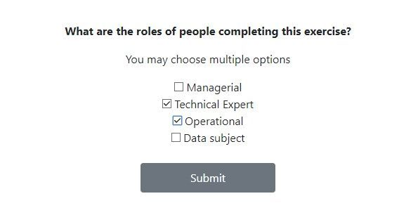
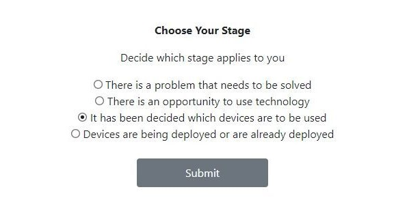
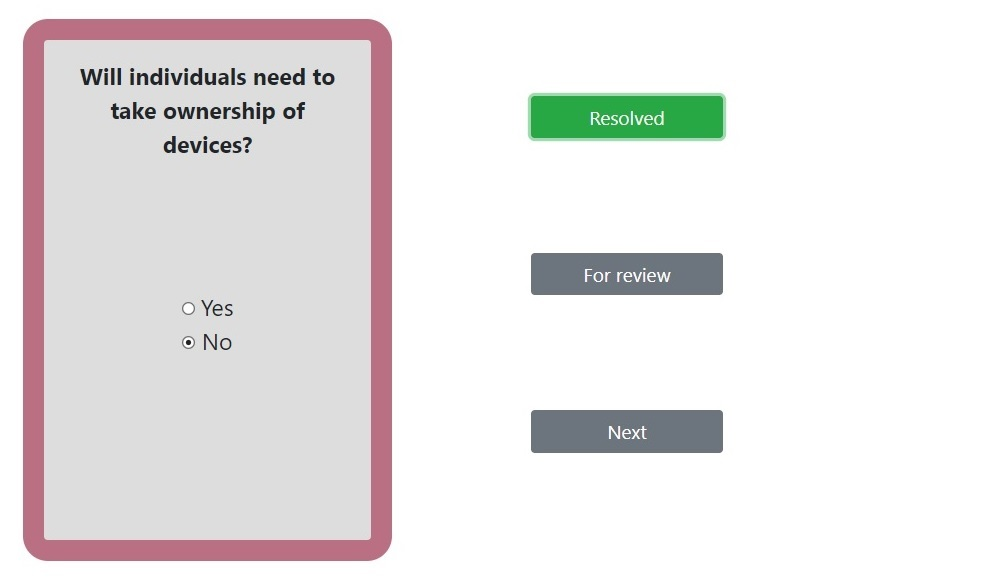
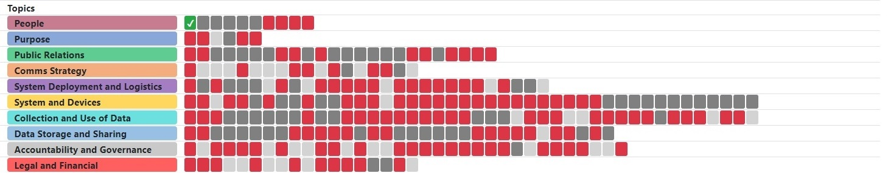
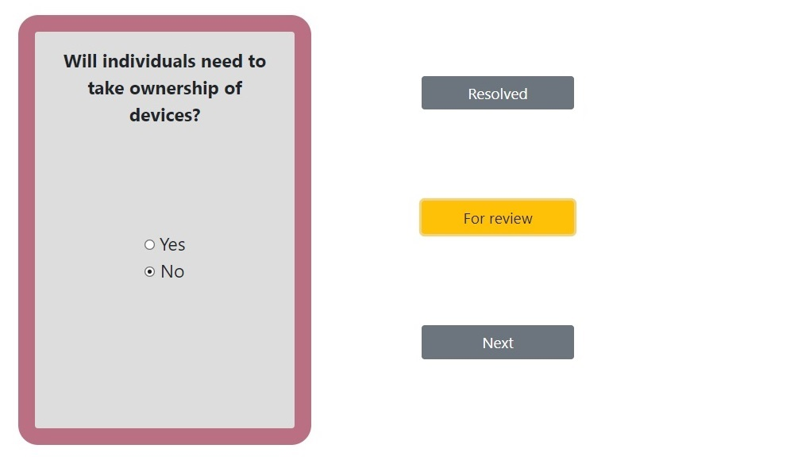
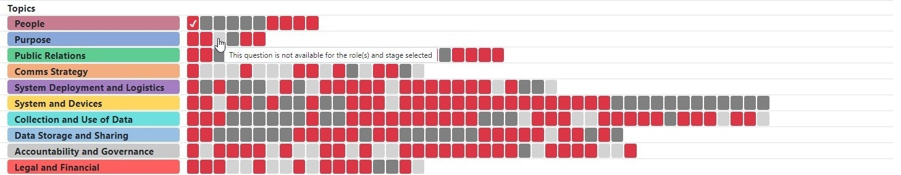
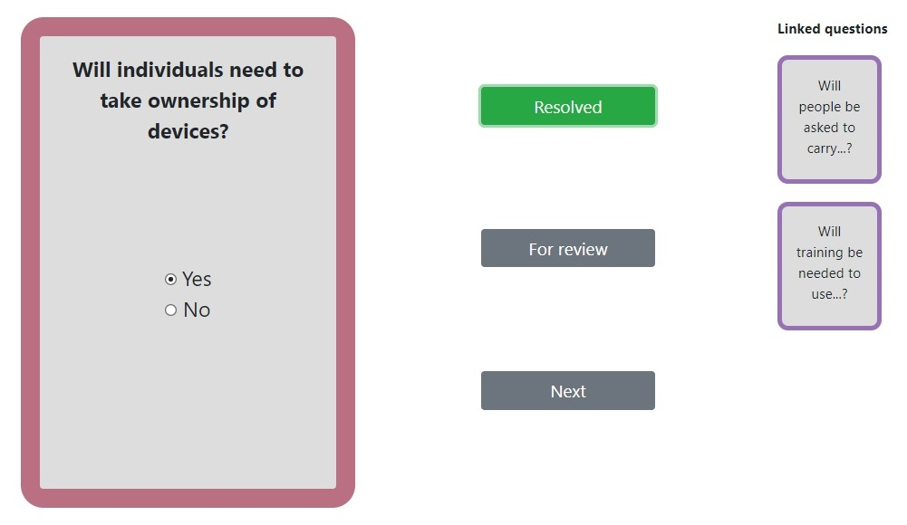
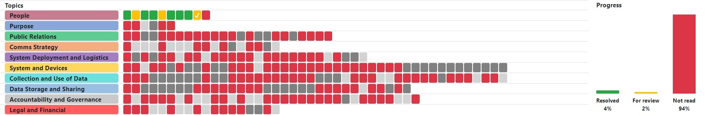
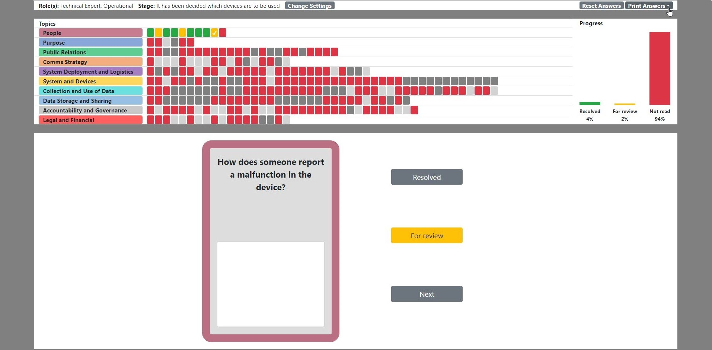
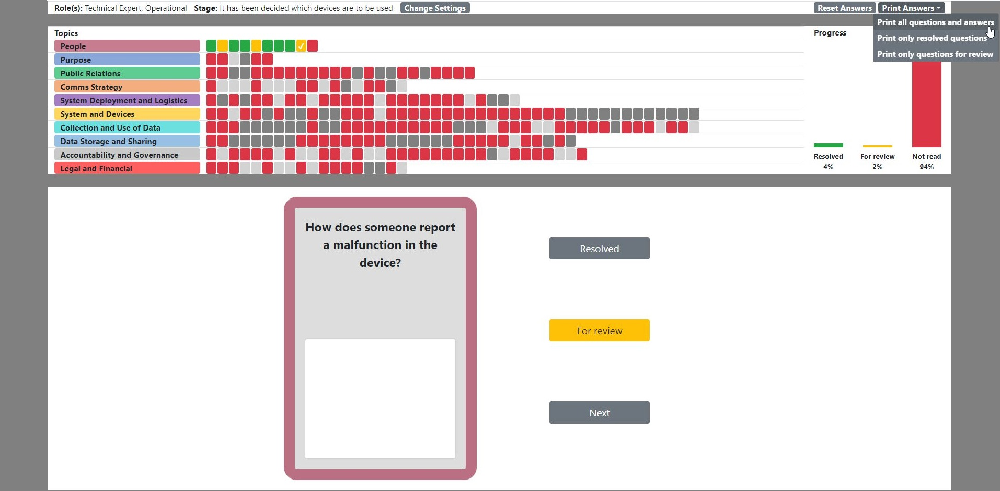

# The IoT TrustTool

&nbsp;

## Why Use This Tool

### *What is IoT*

The Internet of Things is a phrase used to refer to physical objects that collect data about their environment, have the ability to transmit this data elsewhere, and can potentially react and carry out certain actions depending on what the sensors record.

### *Who might benefit from this tool?*

Many organisations are interested in the way that this technology can be used in public spaces to solve problems or provide opportunities for new benefits to society. For example, smart street lights which only turn on when they are needed, or a network of sensors that provide data on air quality.

Examples of organisations that might be deploying devices like these include public sector bodies such as local councils who are interested in developing so-called smart cities, citizen groups who wish to use technology to understand the areas in which they live, or companies that see opportunities for collecting and using public space data as part of their business model.

### *Things to keep in mind*

There are many questions that need to be considered in such deployments to make sure that the technology is being used to everyone’s benefit. Potential problems such as privacy risks must be understood and mitigated, and information should be available to those who might wish to understand the system, such as members of the public.

### *To help you…*

We have developed a digital tool which presents some questions to those creating or assessing deployments, to help them in this process. It can be used by a variety of types of organisation, and different representatives within these organisations. By going through this process you can discover what information is available about the deployment, have the answers handy in one place, discover areas where you might not know the answers right now, and consider where you might need to seek additional information.
 
&nbsp;

## How to Use This Tool

### *1. Who are you?*

The Tool is designed to be most useful in a group setting. When you first load the tool, it will ask you to state who is completing the exercise. You can choose multiple options if there are people present with different types of knowledge about the deployment. The greater the variety of knowledge available, the easier it will be to answer the questions.

&nbsp;

### *2. Choose Your Stage*

Next, decide which stage applies to the deployment you are considering.

Note that you will most likely choose either stage 1 or stage 2, and will not necessarily need both of them, however you may later move on from these to stages 3 and 4 if necessary.

**Examples**

*Stage 1 example: A community group would like to know more about noise levels in different parts of the city, to identify areas that are particularly noisy or quiet and understand how this changes at different times of the day, and on different days of the week.*

*Stage 2 example: There is a new LORAWAN (low power wide area) network being installed across a region, and the local city council has funding from a Smart City programme to purchase some devices which can use the network to transmit information they collect.*

*Stage 3 example: A university campus has purchased a number of sensors which detect occupancy levels in various buildings, to improve use of space.*

*Stage 4 example: Smart dustbins have been installed in a local area, which send information on their fill levels to allow more efficient waste collection.*

&nbsp;

### *3. Choose Your Topic*

There are 10 Question Topics, each of which refers to a different aspect of your IoT deployment.

These can be explored in any order, but our recommended order is:

**People**

**Purpose**

**Public Relations**

**Comms Strategy**

**Systems Deployment & Logistics**

**Systems & Devices**

**Collection & Use of Data**

**Data Storage & Sharing**

**Accountability & Governance**

**Legal & Financial**

&nbsp;

### *4. Consider the Questions*

Look at each question in the order which they are presented.

For each question, you have two possible actions:

**Fully answer the question - RESOLVED**

If you know the answer to the question, click the radio buttons or type your answer (depending on the type of question). This may involve some discussion among the group. Some cards are multiple choice, and you may wish to add notes with more details as well as the answer.

You can then click the ‘Resolved’ button, which marks the question as completed.

The question will be displayed as green in the guide track at the top of your screen

**Partially answer the question or save the question to answer later – FOR REVIEW**

If you do not have enough information to answer the question, or it is a question that you think someone else needs to answer, fill in as much of the answer as possible.

You can then click the ‘For Review’ button, which marks the question as not yet fully completed.

The question will be displayed as orange in the guide track at the top of your screen.

**Once you have satisfactorily dealt with the question in one of the above ways, you can click ‘next’ to move on to the next question in the category**

&nbsp;

### *5. Unavailable questions*

Some questions are not applicable to all stages of deployment, or can only be answered by certain types of representatives. Some questions are also dependent on earlier answers. Questions that are not applicable to your situation will not be presented to you, and will be displayed as grey in the guide track at the top of your screen.

Some questions appear only based on your answers to earlier questions. If one of these questions is displayed to you, it will show next to it the related questions so that you can review these.

&nbsp;

### *7. Tracking your progress*

A progress bar is displayed at the top right of your screen. This shows you as a percentage of the total how many questions you have answered, saved for review, or have not yet had a look at.

&nbsp;

### *8. Reviewing your answers*

At any time, you may use the ‘print’ function to review your answers so far.

You can choose to display your resolved questions, your questions for review, or both.

You may find it helpful to print a list of the questions for review so that you can use this to do research into answering them, or consult with others in your organisation who can provide the answers.

&nbsp;

## About The Tool

### *Who developed this tool?*

This tool was developed as part of the TrustLens project, which is a collaboration between the University of Aberdeen, Nottingham University and City University, London. The project is funded by the Engineering and Physical Sciences Research Council (EPSRC). The goals of the project were to understand and enable trusted IoT ecosystems.

### *Where did the questions come from?*

The questions were developed through research which was carried out between 2017 and 2019 using a variety of methods. This included reviews of literature about transparency in IoT, interviews with organisations developing IoT projects, working closely with communities to explore what members of the public might want to know about IoT projects that affect them, and a number of interactive workshops.
